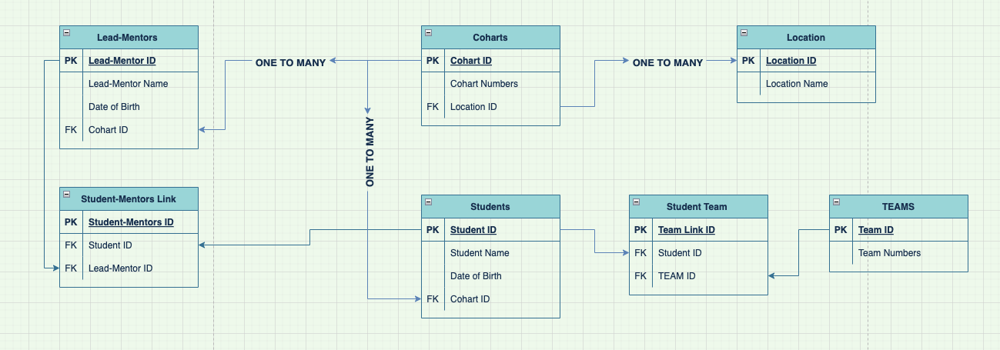

# Schemas and relationships

## What is schema ?

``` A database schema is an abstract design that represents the storage of your data in a database. It describes both the organization of data and the relationships between tables in a given database.The visual style of a database schema allows programmers to structure the database and its relationships properly before jumping into the code ```


## what schema includes ?
- All important or relevant data.
- Consistent formatting for all data entries.
- Unique keys for all entries and database objects.
- Each column in a table has a name and data type.
- Relation between tables.
 
## why we need schema ?
- We need the schema to clarify the necessary data, the number of tables and the relationships between them. 
- Database schemas are important because they help developers visualize how a database should be structured. 
- Having a schema gives developers a clear point of reference about what tables and fields a project contains.
- To allow many users to use one database without interfering with each other.
- To organize database objects into logical groups to make them more manageable.
- Third-party applications can be put into separate schemas so they do not collide with the names of other objects.

## Why is it important to design a database schema before adding data into a database ?
- The good database design Divides your information into subject-based tables to reduce redundant data. 
- Provides Access with the information it requires to join the information in the tables together as needed. 
- Helps support and ensure the accuracy and integrity of your information 


# Primary key 

## What is primary key ?
``` A primary key is a special relational database table column (or combination of columns) designated to uniquely identify each table record. ```

## What's the primary key features ?
- It must contain a unique value for each row of data.
- It cannot contain null values.
- Every row must have a primary key value.

## Why we need the primary key ?
- Primary key is used as a unique identifier to quickly parse data within the table. A table cannot have more than one primary key. 
- Database operations like searching for records are faster because an index is used, based on the primary key.
- Using the primary key, you can easily identify and find unique rows in the database table.
- They allow you to update/delete only specific records by uniquely identifying them.
- The table’s data is sorted based on the primary key.
- It's help you avoid inserting duplicate records in a table.
- it's allows us to create referential integrity constraints (i.e. use of foreign keys).

# Visual representation schema for a database about GSG code Academy.

 <br>


